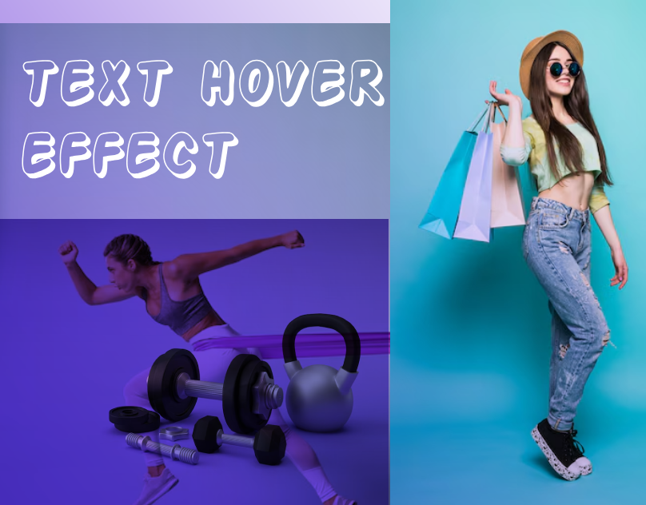

# CSS Hover Effects | Stylish Text Animations & Transitions

<a href="https://www.linkedin.com/in/dharmendraverma95/" target="_blank">LinkedIn Profile </a>

<a href="https://www.behance.net/dhirukumar" target="_blank">Behance Profile </a>

This is a simple web project demonstrating various CSS text hover effects. The project showcases how to apply different hover transitions and animations to text elements using pure CSS, without relying on JavaScript.

### Features
<ul>
  Text Change: Change in the text when hovered.
</li>
  <li>img Animation: Add an animated img effect on hover.

</li>
  <li>Smooth Transitions: All hover effects are smooth and easy to customize.</li>
</ul>

# Preview

 

 
cover

 
element

 
###### Lang
<ul>
  <li>HTML5</li>
  <li>CSS3</li>
  <li>JavaScript</li>

</ul>

